# Snort Walkthrough and Documentation

## Task 1

Task 1 of the Snort room is an introduction. It recommends the [Network Fundamentals](https://tryhackme.com/module/network-fundamentals) room as a prerequisite to this room. It also recommends to have a knowledge of the Linux Command line and to potentially use the Linux Fundamentals rooms as well for this:[1](https://tryhackme.com/room/linuxfundamentalspart1) [2](https://tryhackme.com/room/linuxfundamentalspart2)  [3](https://tryhackme.com/room/linuxfundamentalspart3). Here, you can find some beginner information about [Snort](https://www.snort.org/).

### Question 1

Read the task above.

#### Answer

**No answer needed.**

## Task 2

Task 2 of the Snort room will require you to Start a virtual machine to access interactive material. The Virtual Machine will look like this and will contain a "Task Exercises" folder:


In the "Task-Exercises" folder, there is a script "traffic-generator.sh" that is used to generate traffic for Snort since the machine has no internet connection.

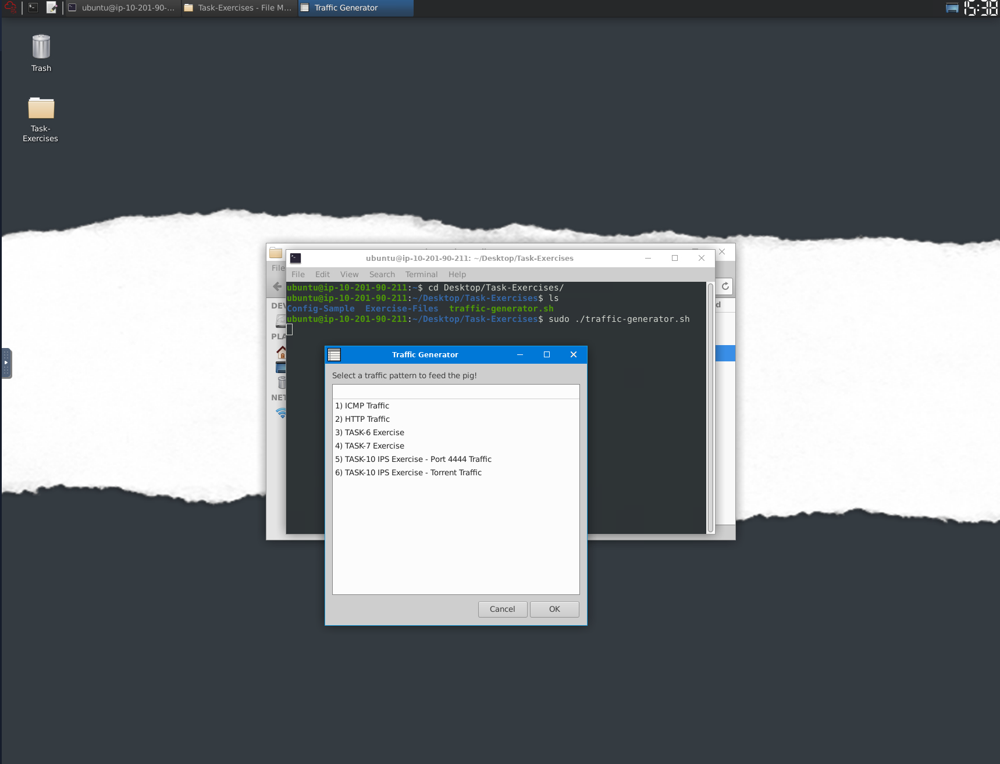

### Question 1

Navigate to the Task-Exercises folder and run the command "./.easy.sh" and write the output

#### Answer 

**Too Easy!**

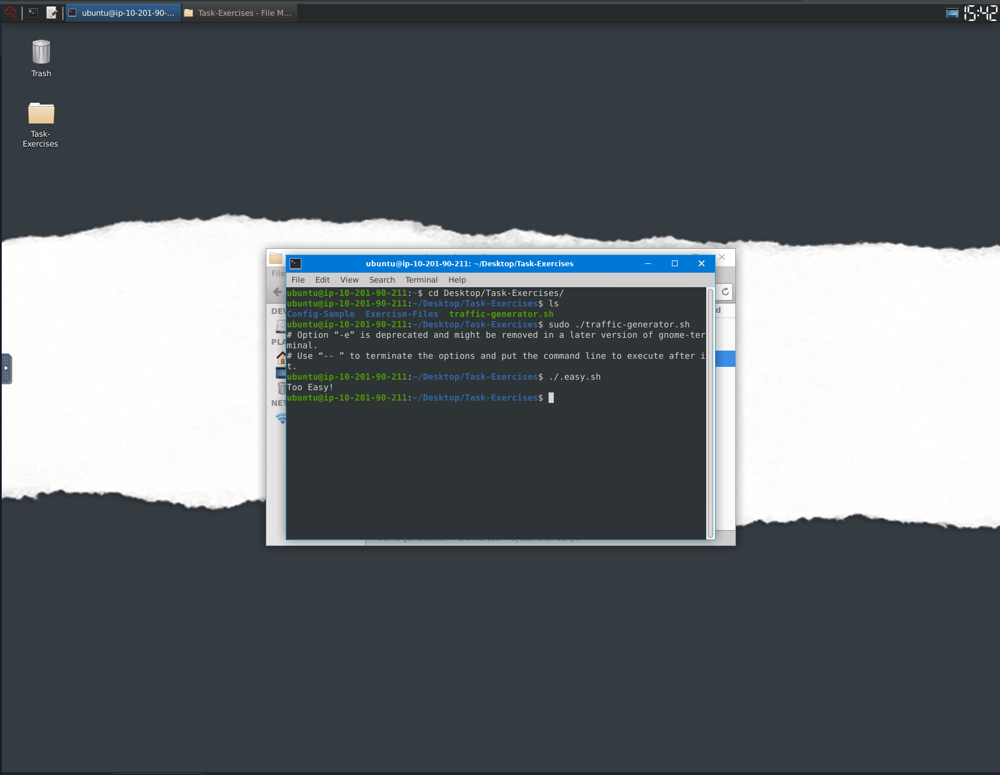

## Task 3

Task 3 in the Snort room is all about the differences between detection and prevention (IPS vs IDS). The biggest difference is that IDS detect and IPS detects and prevents (takes action on). IDS has:

- Network-Based Intrusion Detection System (NIDS)
- Host-Based Intrusion Detection System (HIDS) 

IPS has 4 different types which are:

- Network Intruction Prevention System (NIPS)
- Behavior-based Intrusion Prevention System (Network Behavior Analysis - NBA)
- Wireless Intrusion Prevention System (WIPS)
- Host-based Intrusion Prevention System (HIPS)

### Question 1

Which IDS or IPS type can help you stop the threats on a local machine?.

#### Answer

**HIPS**

### Question 2

Which IDS or IPS type can help you detect threats on a local network?

#### Answer

**NIDS**

### Question 3

Which IDS or IPS type can help you detect the threats on a local machine?

#### Answer

**HIDS**

### Question 4

Which IDS or IPS type can help you stop the threats on a local network?

#### Answer

**NIPS**

### Question 5

Which described solution works by detecting anomalies in the network?

#### Answer

**NBA**

### Question 6

According to the official description of the snort, what kind of NIPS is it?

#### Answer

**full-blown**

### Question 7

NBA training period is also known as ...

#### Answer

**baselining**

## Task 4

We can verify snort is installed and verify the version by running the following:

```snort -V```

We can also make sure that our snort configuration file is correct by running the following:

```sudo snort -c /etc/snort/snort.conf -T```

### Question 1

Run the Snort instance and check the build number.

#### Answer

**149**

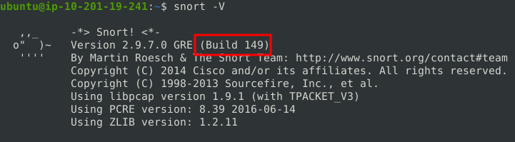

### Question 2

Test the current instance with "/etc/snort/snort.conf" file and check how many rules are loaded with the current build.

#### Answer

**4151**

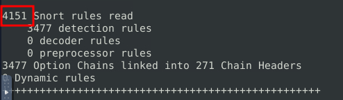

### Question 3

Test the current instance with "/etc/snort/snortv2.conf" file and check how many rules are loaded with the current build.

#### Trials

For this, we can use the following command:

```sudo snort -c /etc/snort/snortv2.conf -T```

#### Answer

**1**

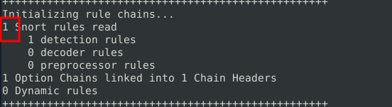

## Task 5

In Snort, you can sniff with -i parameter to specify an interface you would like to "sniff". For example, if I wanted to sniff traffic on the eth0 interface I would run the following:

```sudo snort -v -i eth0```

If we want to run snort in verbose mode(-v) (this will show the packets inside of the terminal) we can do the following:

```sudo snort -v```

We can also run snort in the dumping packet data mode(-d), which will be similar to verbose mode but with more data:

```sudo snort -d```

Similarly, we can run snort in dumping packet data mode (-d) along with link-layer heading grabbing (-e):

```sudo snort -d -e```

Finally, we can run with full packet data dump mode (-X):

```sudo snort -X```

### Snort Parameters

**`-v`** - Verbose. Display the TCP/IP output in the console.

**`-d`** - Display the packet data (payload).

**`-e`** - Display the link-layer (TCP/IP/UDP/ICMP) headers.

**`-X`** - Display the full packet details in HEX.

**`-i`** - This parameter helps to define a specific network interface to listen/sniff.

### Question 1

You can practice the parameter combinations by using the traffic-generator script.

#### Answer

**No answer needed**

## Task 6

### Snort in Logger Mode Parameters

**`-l`** - Logger mode, target log and alert output directory. Default output folder is /var/log/snort The default action is to dump as tcpdump format in /var/log/snort

**`-K ASCII`** - Log packets in ASCII format.

**`-r`** - Reading option, read the dumped logs in Snort.

**`-n`** - Specify the number of packets that will process/read. Snort will stop after reading the specified number of packets.

We can start snort in packet logger mode with the following command:

```sudo snort -dev -l .```

This will create a file in binary/tcpdump format.

To create a log in readable format, we can run the following:

```sudo snort -dev -K ASCII -l .```

You can also pass the `-r` parameter to read a snort log:

```sudo snort -r snort.log.1758560978```

**Note the log name will be different**

### Question 1

Investigate the traffic with the default configuration file with ASCII mode.

```sudo snort -dev -K ASCII -l .```
Execute the traffic generator script and choose "TASK-6 Exercise". Wait until the traffic ends, then stop the Snort instance. Now analyse the output summary and answer the question.

```sudo ./traffic-generator.sh```
Now, you should have the logs in the current directory. Navigate to folder "145.254.160.237". What is the source port used to connect port 53?

#### Answer

**3009**

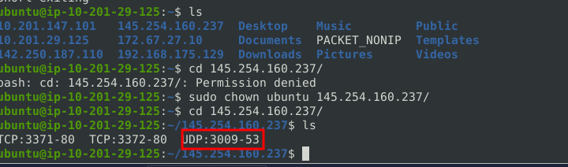

### Question 2

Use snort.log.1640048004 

Read the snort.log file with Snort; what is the IP ID of the 10th packet?

```snort -r snort.log.1640048004 -n 10```

#### Answer

**49313**

Navigate to the Task 6 directory from the home directroy:

```cd Desktop/Task-Excercies/TASK-6```

From there, run the command in the question:

```snort -r snort.log.1640048004 -n 10```

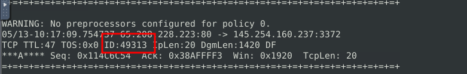

### Question 3

Read the "snort.log.1640048004" file with Snort; what is the referer of the 4th packet?

#### Answer

**http://www.ethereal.com/development.html**

To find this answer, you can use the `-X` to display the results in ASCII format. Run the following command:

```snort -Xr snort.log.1640048004 -n 4```

The refferer will be right down at the bottom of the packet.

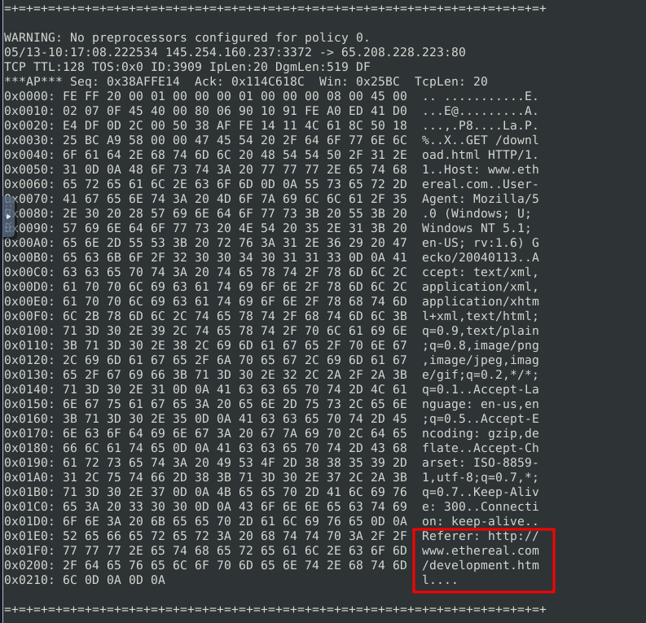

### Question 4

Read the "snort.log.1640048004" file with Snort; what is the Ack number of the 8th packet?

#### Answer

**0x38AFFFF3**

Similar to the last question. Use the following command:

```snort -Xr snort.log.1640048004 -n 8```

On the 8th packet you will see an ACK field. There is your answer.

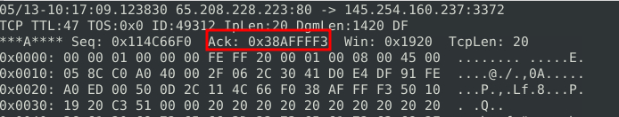

### Question 5

Read the "snort.log.1640048004" file with Snort; what is the number of the "TCP port 80" packets?

#### Answer

**41**

This question is just looking for the numbert of packets that fit this description. Here is the command I used:

```snort -r snort.log.1640048004 'tcp and port 80'```

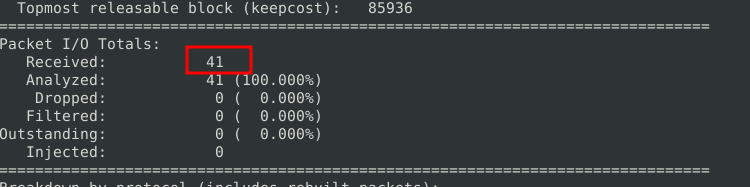

## Task 7

### Snort in IDS/IPS Mode Parameters

**`-c`** - Defining the configuration file.
**`-T`** - Testing the configuration file.
**`-N`** - Disable logging.
**`-D`** - Background mode.
**`-A`** - Alert modes;
full: Full alert mode, providing all possible information about the alert. This one also is the default mode; once you use -A and don't specify any mode, snort uses this mode.

fast:  Fast mode shows the alert message, timestamp, source and destination IP, along with port numbers.

console: Provides fast style alerts on the console screen.

cmg: CMG style, basic header details with payload in hex and text format.

none: Disabling alerting.

We can start snort and test the configuration file with the following command:

```sudo snort -c /etc/snort/snort.conf -T```

We can start snort and disable logging with the following command:

```sudo snort -c /etc/snort/snort.conf -N```

We can start snort in background mode with the following command:

```sudo snort -c /etc/snort/snort.conf -D```

We can start snort with console mode which will provide console style alerts:

```sudo snort -c /etc/snort/snort.conf -A console```

We can start snort with cmg mode which will provide basic header details in the terminal:

```sudo snort -c /etc/snort/snort.conf -A cmg```

We can start snort with fast mode which will provide alert messages, timestamps, source and destination IPs:

```sudo snort -c /etc/snort/snort.conf -A fast```

We can start snort with full mode which will provide all information possible about an alert:

```sudo snort -c /etc/snort/snort.conf -A full```

Finally, we can start snort with none mode which will disable logging:

```sudo snort -c /etc/snort/snort.conf -A none```

#### Question 1

Investigate the traffic with the default configuration file.

```sudo snort -c /etc/snort/snort.conf -A full -l .```
Execute the traffic generator script and choose "TASK-7 Exercise". Wait until the traffic stops, then stop the Snort instance. Now analyse the output summary and answer the question.

```sudo ./traffic-generator.sh```
What is the number of the detected HTTP GET methods?

#### Answer

**2**

For this question, you will want to start the full logging by using the following command provided in the question:

```sudo snort -c /etc/snort/snort.conf -A full -l .```

From there, you will start the traffic generator for Task 7:

```sudo ./traffic-generator.sh```

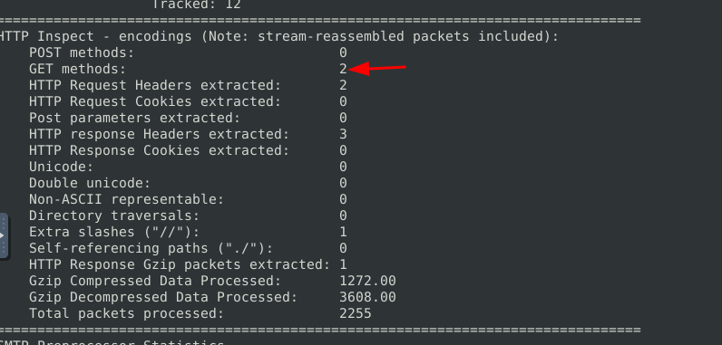

### Question 2

You can practice the rest of the parameters by using the traffic-generator script.

#### Answer

**No answer needed**

** Task 8

*** PCAP Investigation with Snort

**`-r / --pcap-single=`** - read a single pcap
**`--pcap-list=""`** - Read pcaps provided in command (space separated)
**`--pcap-show`** - Show pcap name on console during processing

We can investigate a PCAP file from the terminal using a command like:

```sudo snort -c /etc/snort/snort.conf -q -r imcp-test.pcap -A console -n 10```

We can do the same thing with a list of PCAPs like this:

```sudo snort -c /etc/snort/snort.conf -q --pcap-list="icmp-test.pcap http2.pcap" -A console -n 10```

We can do something similar but distinguish each PCAP with the following:

```sudo snort -c /etc/snort/snort.conf -q --pcap-list="icmp-test.pcap http2.pcap" -A console --pcap-show```

### Question 1

Investigate the mx-1.pcap file with the default configuration file.

```sudo snort -c /etc/snort/snort.conf -A full -l . -r mx-1.pcap```
What is the number of the generated alerts?

#### Answer

**170**

Run the specified command: 

```sudo snort -c /etc/snort/snort.conf -A full -l . -r mx-1.pcap```

If you scroll up in the output you will see a field called alerts:

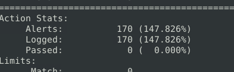

### Question 2

Keep reading the output. How many TCP Segments are Queued?

#### Answer

**18**

If you scroll further down in the output, you will find your answer:

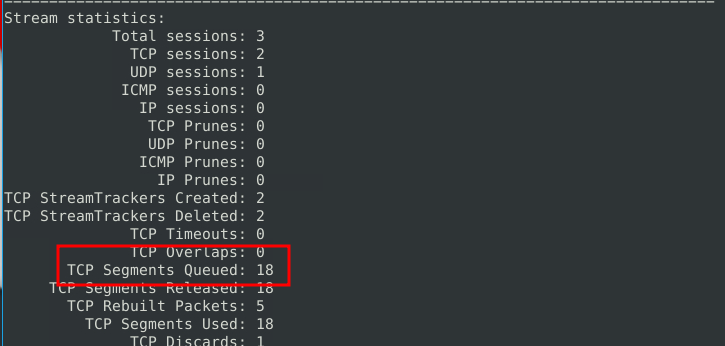

### Question 3

Keep reading the output.How many "HTTP response headers" were extracted?

#### Answer

**3**

Further down in the output, we find HTTP Response Headers Extracted to equal 3:

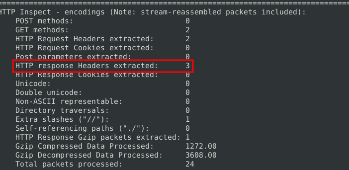

### Question 4

Investigate the mx-1.pcap file with the second configuration file.

```sudo snort -c /etc/snort/snortv2.conf -A full -l . -r mx-1.pcap```
What is the number of the generated alerts?

#### Answer

**68**

Follow the same steps as question 1 but with a new  configuration file:

```sudo snort -c /etc/snort/snortv2.conf -A full -l . -r mx-1.pcap```

### Question 5

Investigate the mx-2.pcap file with the default configuration file.

```sudo snort -c /etc/snort/snort.conf -A full -l . -r mx-2.pcap```
What is the number of the generated alerts?

### Answer

**340**

Follow the same steps as question 4 and question 5. Run the following command and find the alerts field:

```sudo snort -c /etc/snort/snort.conf -A full -l . -r mx-2.pcap```

### Question 6

Keep reading the output. What is the number of the detected TCP packets?

#### Answer

**82** 

I found this by reading the output and finding TCP Port Filter > Tracked:

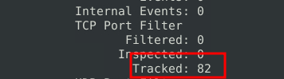

### Question 7

Investigate the mx-2.pcap and mx-3.pcap files with the default configuration file.

```sudo snort -c /etc/snort/snort.conf -A full -l . --pcap-list="mx-2.pcap mx-3.pcap"```
What is the number of the generated alerts?

#### Answer

**1020**

Run the following command:

```sudo snort -c /etc/snort/snort.conf -A full -l . --pcap-list="mx-2.pcap mx-3.pcap"```

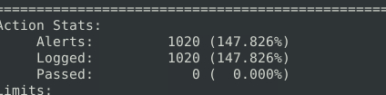

## Task 9

### Snort Rules

**`action`** - There are several actions for rules. Make sure you understand the functionality and test it before creating rules for live systems. The most common actions are listed below.

    alert: Generate an alert and log the packet.
    log: Log the packet.
    drop: Block and log the packet.
    reject: Block the packet, log it and terminate the packet session. 

**`Protocol`** - Protocol parameter identifies the type of the protocol that filtered for the rule.

Note that Snort2 supports only four protocols filters in the rules (IP, TCP, UDP and ICMP). However, you can detect the application flows using port numbers and options. For instance, if you want to detect FTP traffic, you cannot use the FTP keyword in the protocol field but filter the FTP traffic by investigating TCP traffic on port 21.

**`IP Filtering`** - alert icmp 192.168.1.56 any <> any any  (msg: "ICMP Packet From "; sid: 100001; rev:1;)
This rule will create an alert for each ICMP packet originating from the 192.168.1.56 IP address.

**`Filter an IP Range`** - alert icmp 192.168.1.56 any <> any any  (msg: "ICMP Packet From "; sid: 100001; rev:1;)
This rule will create an alert for each ICMP packet originating from the 192.168.1.56 IP address.

**`Filter multiple IP ranges`** - alert icmp [192.168.1.0/24, 10.1.1.0/24] any <> any any  (msg: "ICMP Packet Found"; sid: 100001; rev:1;)
This rule will create an alert for each ICMP packet originating from the 192.168.1.0/24 and 10.1.1.0/24 subnets.

**`Exclude IP addresses/ranges`** - alert icmp [192.168.1.0/24, 10.1.1.0/24] any <> any any  (msg: "ICMP Packet Found"; sid: 100001; rev:1;)
This rule will create an alert for each ICMP packet originating from the 192.168.1.0/24 and 10.1.1.0/24 subnets.

**`Port Filtering`** - alert tcp any any <> any 21  (msg: "FTP Port 21 Command Activity Detected"; sid: 100001; rev:1;)
This rule will create an alert for each TCP packet sent to port 21.

**`Exclude a specific port`** - alert tcp any any <> any !21  (msg: "Traffic Activity Without FTP Port 21 Command Channel"; sid: 100001; rev:1;)
This rule will create an alert for each TCP packet not sent to port 21.

**`Filter a port range (Type 1)`** - alert tcp any any <> any 1:1024   (msg: "TCP 1-1024 System Port Activity"; sid: 100001; rev:1;)
This rule will create an alert for each TCP packet sent to ports between 1-1024.

**`Filter a port range (Type 2)`** - alert tcp any any <> any 1:1024   (msg: "TCP 1-1024 System Port Activity"; sid: 100001; rev:1;)
This rule will create an alert for each TCP packet sent to ports between 1-1024.

**`Filter a port range (Type 3)`** - alert tcp any any <> any 1025: (msg: "TCP Non-System Port Activity"; sid: 100001; rev:1;)
This rule will create an alert for each TCP packet sent to source port higher than or equal to 1025.

**`Filter a port range (Type 4)`** - alert tcp any any <> any 1025: (msg: "TCP Non-System Port Activity"; sid: 100001; rev:1;)
This rule will create an alert for each TCP packet sent to source port higher than or equal to 1025.

### Question 1

Use "task9.pcap". Write a rule to filter IP ID "35369" and run it against the given pcap file. What is the request name of the detected packet? You may use this command: "```snort -c local.rules -A full -l . -r task9.pcap```"

#### Answer

**TIMESTAMP REQUEST**

Configure the following rule in rules.local:

```alert ip any any <> any any (msg: "IP ID 35369 found" id:35369; sid:1000001; rev:1;)```

If you then run the command specified in the question and then run:

```cat alert```

You will get the following output:

```[**] [1:1000001:1] IP ID 35369 found [**]```
```[Priority: 0] ```
```03/03-20:00:32.042975 192.168.121.2 -> 192.168.120.1```
```ICMP TTL:255 TOS:0x0 ID:35369 IpLen:20 DgmLen:40```
```Type:13  Code:0  ID: 7  Seq: 6  TIMESTAMP REQUEST```

### Question 2

Clear the previous alert file and comment out the old rules. Create a rule to filter packets with Syn flag and run it against the given pcap file. What is the number of detected packets?

#### Answer

**1**

Add the following rule:

```alert tcp any any <> any any (msg: "SYN flag detected"; flags:S; sid:1000001; rev:1;)```

Then run the following command:

```snort -c local.rules -A full -l . -r task9.pcap```

Then cat the alert file:

```cat alert```

### Question 3

Clear the previous alert file and comment out the old rules. Write a rule to filter packets with Push-Ack flags and run it against the given pcap file. What is the number of detected packets?

#### Answer

**216**

This one I used the following rule:

```alert tcp any any <> any any (msg: "Push-Ack flag detected"; flags:PA; sid:100001; rev:1;)```

The ran the command:

```snort -c local.rules -A full -l . -r task9.pcap```

From there, I found the number of packets by grepping for 'Push-Ack flag detected':

```grep -c 'Push-Ack flag detected' alert```

That will give 216

### Question 4 

Clear the previous alert file and comment out the old rules. Create a rule to filter UDP packets with the same source and destination IP and run it against the given pcap file. What is the number of packets that show the same source and destination address?

#### Answer

**7**

Add the following rule to local.rules:

```alert udp any any <> any any (msg: "Same IP found"; sameip; sid:1000001; rev:1;)```

Then run the following command:

```snort -c local.rules -A full -l . -r task9.pcap```

To find the number of packets, do the following:

```grep -c "Same IP" alert```

### Question 5

Case Example - An analyst modified an existing rule successfully. Which rule option must the analyst change after the implementation?

#### Answer

**rev**

## Task 10

### Question 1

Read the task above.

#### Answer 

**No answer needed**

## Task 11

### Notes

Snort cheatsheet from TryHackMe can be found here:


### Question 1

Read the task above.

#### Answer

**No answer needed**


