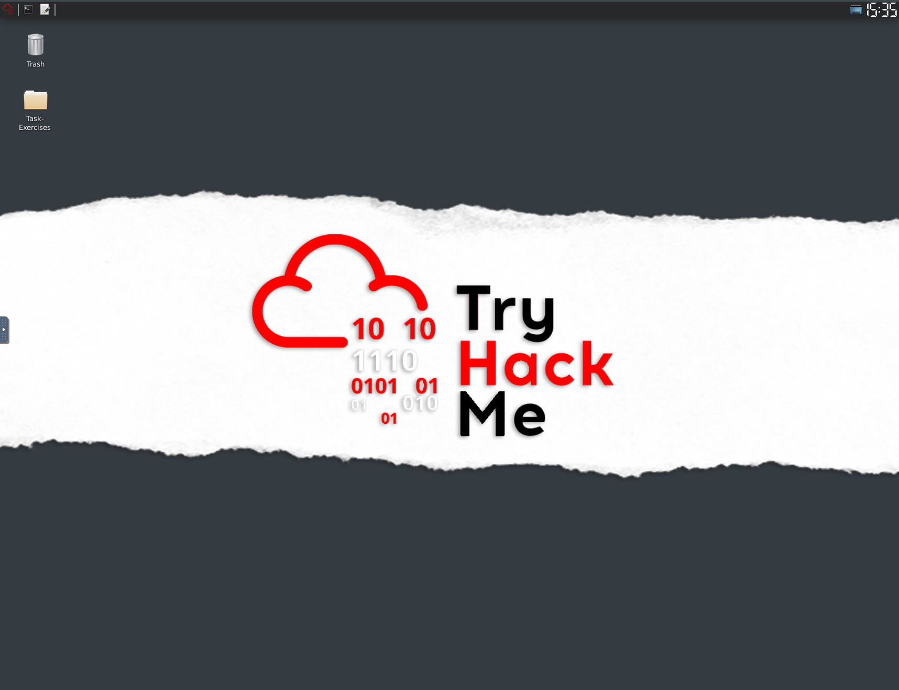

# Snort Walkthrough and Documentation

## Task 1

Task 1 of the Snort room is an introduction. It recommends the [Network Fundamentals](https://tryhackme.com/module/network-fundamentals) room as a prerequisite to this room. It also recommends to have a knowledge of the Linux Command line and to potentially use the Linux Fundamentals rooms as well for this:[1](https://tryhackme.com/room/linuxfundamentalspart1) [2](https://tryhackme.com/room/linuxfundamentalspart2)  [3](https://tryhackme.com/room/linuxfundamentalspart3). Here, you can find some beginner information about [Snort](https://www.snort.org/).

### Question 1

Read the task above.

#### Answer

No answer needed.

## Task 2

Task 2 of the Snort room will require you to Start a virtual machine to access interactive material. The Virtual Machine will look like this and will contain a "Task Exercises" folder:

In the "Task-Exercises" folder, there is a script "traffic-generator.sh" that is used to generate traffic for Snort since the machine has no internet connection.

### Question 1

Navigate to the Task-Exercises folder and run the command "./.easy.sh" and write the output

#### Answer 

Too Easy!

